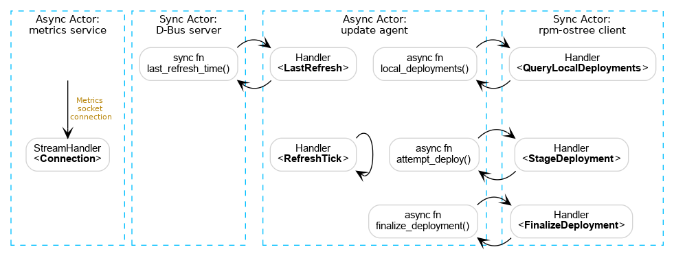

# Actor model and agent subsystems

Zincati `agent` command provides a long-running background service which drives the OS through auto-updates.
It comprises several logical subsystems which can run in parallel and are arranged following the [actor model][wiki-actors].

The goal of this design is manifold:
 * it allows splitting logical subsystems into separate failure domains.
 * it models asynchronous operations and parallel components in an explicit way.
 * it minimizes the amount of shared state and locks, minimizing the chances of deadlocks and concurrency bugs.

[wiki-actors]: https://en.wikipedia.org/wiki/Actor_model

## Actor system

The core of the agent service is built on top of [Actix][actix], an asynchronous actor framework.
The only exception is the initialization logic (i.e. CLI flags and configuration files parsing), which is performed in a synchronous way and only once at service startup.

[actix]: https://github.com/actix/actix

A general overview on such actor framework is provided by the [Actix book][actix-book], and further API details are covered by its [documentation](docs-rs-actix).
There is also a companion web-framework called `actix-web`, which is however not relevant in this context.

[actix-book]: https://actix.rs/book/actix/
[docs-rs-actix]: https://docs.rs/actix

The agent is split into several actors, which encapsulate state and behavior, as shown in the diagram below.
They can run in parallel and communicate by exchanging messages.

### Metrics service

The "metrics service" actor is responsible for serving client requests on the local [metrics endpoint][usage-metrics].
It does not exchange message with other actors, and it asynchronously processes the stream of incoming connections.

Once accepted, each new client connection is represented as a `Connection` message.

[usage-metrics]: ../usage/metrics.md

### Update agent

The "update agent" actor contains the core logic of Zincati agent.

This actor manages the Finite State Machine (FSM) which supervises the auto-update flow.
A time-based ticker drives the state machine. Timer ticks are represented by `RefreshTick` messages, which are sent by the actor to itself (with a delay) at each iteration.

This actor interacts with some local subsystems (e.g. the underlying Operating System) and also with remote ones (e.g. the Cincinnati service).
In general, operations which cannot be performed in a non-blocking way are delegated to other dedicated actors (e.g. rpm-ostree tasks).

### Rpm-ostree client

The "rpm-ostree client" actor is responsible for shelling out to the `rpm-ostree` command, in order to interact with the rpm-ostree daemon.
As client commands require blocking and may take a long time to complete, this entity is implemented as a synchronous actor.

This actor bridges incoming requests (messages) to rpm-ostree actions (CLI commands):
 * `QueryLocalDeployments` maps to `rpm-ostree status`.
 * `FinalizeDeployment` maps to `rpm-ostree finalize-deployment`.
 * `StageDeployment` maps to `rpm-ostree deploy --lock-finalization`.

Those actions are generally requested by the core "update agent" actor via the relevant message, and (processed) results are sent back to it once the task has completed.
